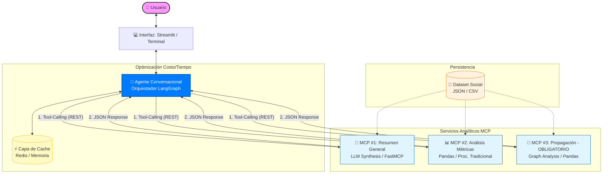

# 🧠 Arquitectura del Flujo y Componentes

## Explicación General

### Capa de Usuario (Input)

El usuario interactúa mediante lenguaje natural (ej: *"¿Cómo está el clima...?"*) a través de una interfaz simple como **Streamlit** o terminal.

---

### Cerebro Central (Agente Orquestador)

Este componente es clave para sumar puntos extra en la evaluación.

* Se recomienda usar **LangGraph** para manejar el estado de la conversación.
* Permite una orquestación explícita y controlada del flujo.

#### Lógica de Decisión (Tool-Calling)

El LLM:

* Analiza la pregunta
* Identifica la intención
* Decide qué herramienta (MCP) debe ejecutar

En lugar de responder directamente, delega el trabajo a microservicios especializados.

---

### Capa de Optimización (Caché - Redis/Memoria)

Clave para eficiencia costo-beneficio:

* Antes de ejecutar análisis:

  * Verifica si ya existe una respuesta cacheada
* Si existe:

  * Se devuelve inmediatamente
  * Se ahorra uso de LLM y tiempo de cómputo

---

### Capa de Microservicios (MCPs)

#### MCP #1: Resumen

* Usa LLM (ej: `gpt-4o-mini`)
* Genera síntesis cualitativa

#### MCP #2: Métricas

* Usa procesamiento tradicional (Python + pandas)
* No requiere LLM
* Entrega datos duros (likes, influencers, etc.)

#### MCP #3: Propagación (**OBLIGATORIO**)

* Implementa:

  * Matching de contenido
  * Estructuras de grafos
* Mide impacto mediático del mensaje

---

### Capa de Datos

* Dataset en formato:

  * JSON o CSV
* Todos los MCP acceden a esta fuente

---

## Diagrama de Arquitectura

---

## Notas para la Implementación

### Agente (Azul)

* Es el corazón del sistema
* Separa:

  * Lógica de negocio (análisis)
  * Lógica de interacción (LLM)
* Mejora claridad y evaluación del diseño

---

### Capa de Cache

* Punto clave de optimización
* Ejemplo:

  * Si preguntan *"¿Quién es el más influyente?"* 3 veces:

    * Solo pagas la API una vez

---

### Servicios MCP

* MCP #2 y MCP #3:

  * No requieren LLM
  * Implementables con Python + pandas
* Beneficios:

  * Menor costo
  * Menor latencia
  * Mayor control

---

### Formato de Salida

* Todos los MCP deben devolver:

  * JSON consistente
* Importante porque:

  * El agente no debe "adivinar" formatos
  * Evita errores en demos

---

## Ventaja del Diseño

Este enfoque modular permite:

* Desarrollar cada MCP de forma independiente
* Probar cada componente aislado
* Integrar todo al final con el agente conversacional
